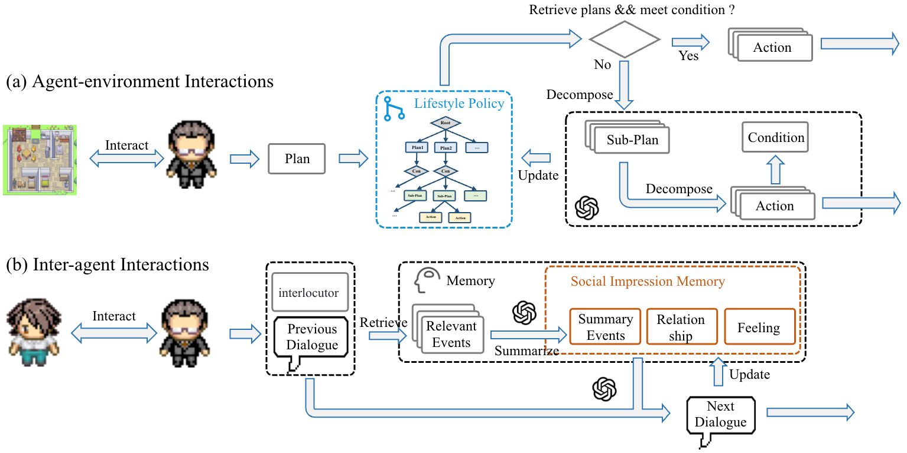

# Affordable Generative Agents (Backend)

<p align="center" width="100%">

</p>

"Affordable Generative Agents (AGA)" is a framework for enabling the generation of believable and low-cost agent-environment and inter-agent interactions. 

## What is the Generative Agents Project?
The [Generative Agents project](https://github.com/joonspk-research/generative_agents), developed by researchers from Stanford University and Google Research in 2023, introduces a groundbreaking [approach]() to creating AI agents that can simulate believable human-like behavior. This research represents an important step forward in artificial intelligence that bridges language models, agent-based systems, and **social simulation**.

# Start simulating
The original repo is not maintained and running the code is quite hard. I forked it and started improving it from making the core running again to adding features. There's a dedicated documentation for the corresponding environment as follows:
- Backend: [Generative Agents](GA/README.md)
- Frontend: [VirtualHome](VirtualHome/README.md)

# Background

## Core Concepts

At its heart, the project explores how to create autonomous AI agents that:

- Maintain coherent memories and experiences over time
- Make decisions based on past experiences and current context
- Reflect on their experiences to form higher-level conclusions
- Develop relationships with other agents
- Generate plausible human-like behaviors without explicit programming

## The ESPOville Simulation

As a demonstration of these concepts, I created "ESPOville," a sandbox environment populated by 3 generative agents. Each agent has:

- A distinct identity and personality
- Daily routines and preferences
- The ability to form relationships with other agents
- Goals and aspirations that drive their behavior

In ESPOville, these agents live their "lives" autonomously - they wake up, make breakfast, go to work, socialize, and engage in various activities without direct human intervention. The fascinating aspect is that complex social behaviors emerge from the interactions between agents. 

**FUN FACT**:
Periodically, I keep adding new personalities, one of them has been posting on my behalf on my personal Facebook & X account. 
The interactions that people have with those accounts are then fed back into the environment where a simulation is launched using what my friends have been saying. At the end of the simulation cycle, a [what if](https://observablehq.com/@d3/parallel-coordinates) report is generated where I learn what could/would have happened if I had posted something else. So far the most likely outcome has been also the most entertaing. 😅
There still a ton of work to do and therefore, you should consider join the fun and contribute!

---

## The Architecture

Each generative agent is built with several key components:

1. **Memory Stream**: A database that stores the agent's experiences, observations, and interactions chronologically.

2. **Retrieval System**: A mechanism that accesses relevant memories based on the current context or query.

3. **Reflection Mechanism**: A process that synthesizes memories into higher-level insights, beliefs, and patterns.

4. **Planning System**: Enables agents to create and execute plans based on their goals, beliefs, and context.

5. **Natural Language Interface**: Allows agents to communicate with each other and with human users.

# Learning Opportunities
You may wonder...ummh what can I do with this? You probably weren't 😅 but let me give youa few hints:

1. **Understanding AI Architecture**: Students can explore how different components (memory, retrieval, planning) work together to create coherent behavior.

2. **Studying Emergent Social Behavior**: Observe how complex social patterns emerge from simple rules and interactions between agents.

3. **Exploring Natural Language Processing**: See how language models can generate contextually appropriate dialogue and narrative.

4. **Ethical Considerations**: Discuss the implications of creating increasingly human-like AI systems.

## Hands-On Projects

1. **Create Custom Agents**: Students can define their own agents with unique personalities, goals, and memories.

2. **Design Social Experiments**: Set up scenarios to test how agents respond to different social situations.

3. **Modify the Environment**: Change aspects of the simulation environment to see how agents adapt.

4. **Analyze Agent Behavior**: Collect data on agent interactions and analyze patterns that emerge.

5. **Extend the Architecture**: Add new capabilities to agents, such as emotional responses or learning mechanisms.

## Technical Skills Development

1. **Python Programming**: The project uses Python, giving students practice with a widely-used language.

2. **Working with Language Models**: Experience how to prompt and use large language models effectively.

3. **Data Management**: Learn how to organize and retrieve structured information (agent memories).

4. **System Architecture**: Understand how complex systems can be built from modular components.

**If it feels rocket science, it isn't.** It's requires will power and an insatiable curiosity. If you have those two elements or can manage to grow them, you'll love playing AI God with this project.

## Creativity is your limit
The techniques developed in this project have potential applications in:

- Video games and interactive entertainment
- Social science research and simulation
- Education and training scenarios
- Testing social dynamics in virtual environments
- Human-computer interaction research

---

## Good To Know
I teach AI to very young or quite old minds as I believe these two sides of the population are the one needing the most support for the AI transition. Sort of what happened from paper to Tablets.

When I read the paper I got very excited but the initial code was only supporting OpenAI. I quickly realized that the cost to just run for a fun moment would have racked cloud bill$, even for an affordable agent 😅. 

So I added support for more cost effective models and start adding features as I learned more about the initial codebase. I have been in the rabbit hole ever since. 🎢 I think this work has a great potential waiting for some creativity and boldness to unlock it. So I am trying.

🧘🏼‍♂️ A good advice for any Internet finding: *I don't know what I am doing* therefore feel encouranged to advice if you have more experience and share your pain if you have less than me. Good luck, to both of us.

---

# Citation

From the authors of the paper: If our work assists your research, feel free to [give us](https://github.com/joonspk-research/generative_agents) a star ⭐ or cite us using:

```
@article{
yu2024affordable,
title={Affordable Generative Agents},
author={Yangbin Yu and Qin Zhang and junyou li and QIANG FU and Deheng Ye},
journal={Transactions on Machine Learning Research},
issn={2835-8856},
year={2024},
url={https://openreview.net/forum?id=7tlYbcq5DY},
note={}
}
```
